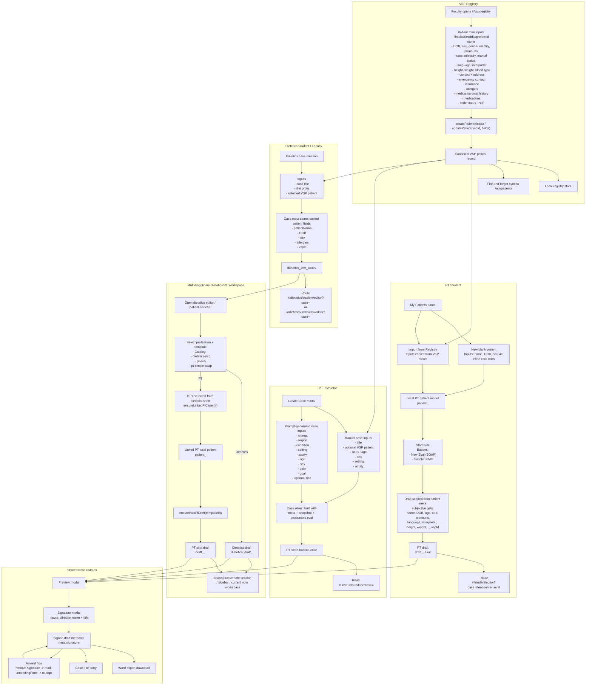
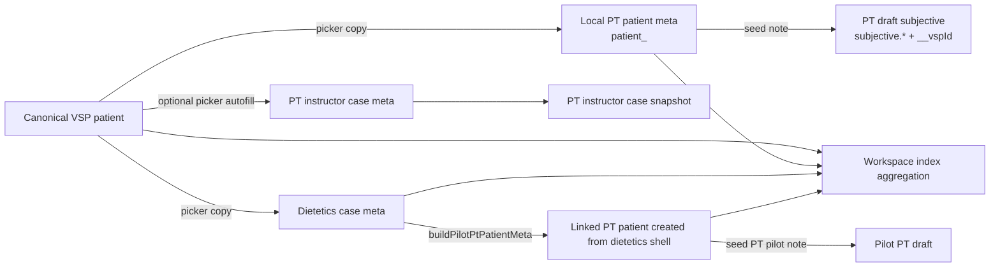
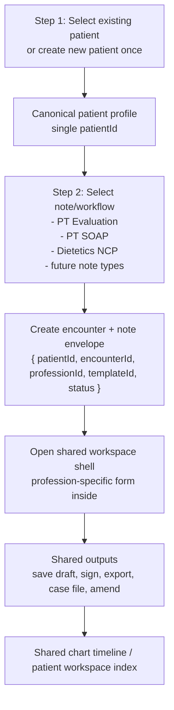

# Patient and Note Creation Flow Map

This document maps the current patient and note creation experience across PT, Dietetics, VSP Registry, and the multidisciplinary workspace.

Goal: make every current input, path, storage target, route transition, and downstream output visible in one place so we can streamline toward a unified experience.

For browser-openable visual versions that do not depend on Mermaid rendering support, open either `docs/patient-note-creation-flow.svg` or `docs/patient-note-creation-flow.html`.

## Current-State Flow

## Inputs, Paths, and Outputs by Funnel

| Funnel                      | Primary inputs                                                      | Main path                                              | Persisted outputs                                                                            |
| --------------------------- | ------------------------------------------------------------------- | ------------------------------------------------------ | -------------------------------------------------------------------------------------------- |
| VSP Registry                | Full patient demographics, contact, clinical, insurance, directives | `#/vsp/registry` -> `createPatient` / `updatePatient`  | Canonical VSP record, local registry store, optional `/api/patients` sync                    |
| PT student local patient    | Inline patient name, DOB, sex, optional VSP import fields           | My Patients -> create/import patient -> start note     | `patient_<id>`, `draft_<id>_eval`, PT editor route                                           |
| PT instructor case          | Manual form or prompt-generation anchors                            | Create Case / Generate Case -> `_createCase(caseData)` | PT case store record, PT instructor editor route                                             |
| Dietetics case              | Title, diet order, picked VSP patient                               | Dietetics cases -> `createNewCase(metaFields)`         | `dietetics_emr_cases`, dietetics editor route                                                |
| Multidiscipline note launch | Existing dietetics case + chosen profession/template                | `createPilotNoteSession()` -> launch template          | `dietetics_draft_<caseId>` or linked `patient_<blankPtId>` + `draft_<blankPtId>_<encounter>` |
| Sign/export/amend           | Preview edits, signature name/title                                 | preview -> sign -> save -> export / case file / amend  | signed draft metadata, Word download, Case File record, amendment history                    |

## Data Duplication Map

## Current Pain Points

1. Patient identity is created in multiple places.
   VSP is the closest thing to a canonical patient, but PT local patients, dietetics case meta, PT instructor case snapshots, and dietetics-created linked PT patients all hold overlapping patient identity fields.

2. Note launch is inconsistent across disciplines.
   PT student creates patient first then note. PT instructor creates case first. Dietetics creates case and patient copy together. The multidisciplinary shell launches notes from an existing dietetics case and may synthesize a PT patient behind the scenes.

3. Note storage is split by discipline and shell.
   PT uses `draft_<caseId>_<encounter>`, dietetics uses `dietetics_draft_<caseId>`, and multidisciplinary PT creates additional linked IDs that are not obviously the same patient to the user.

4. Patient demographics are copied forward instead of referenced.
   Name, DOB, sex, allergies, language, interpreter needs, height/weight, and `vspId` are copied into case meta and note subjective payloads, which creates drift risk.

5. Shared outputs happen late instead of from a common note envelope.
   Sign/export/amend/case-file behavior is increasingly shared, but the inputs still arrive from discipline-specific draft shapes and storage keys.

## Unified Target Funnel

## Recommended Streamlining Moves

1. Make the VSP-style patient record the only patient creation source.
   Every creation flow should begin with "select patient" or "create patient", then carry a single `patientId` forward instead of copying patient identity into case-local stores.

2. Introduce one note envelope abstraction for every discipline.
   PT and dietetics drafts should both resolve to one storage contract such as `{ patientId, encounterId, professionId, templateId, content, status, signature, sourceCaseId }`.

3. Separate patient creation, case context, and note launch.
   The UI should present one front door: patient -> note type -> workspace. Optional case metadata like setting, acuity, or diet order should attach as encounter/context fields, not as alternate patient sources.

4. Stop synthesizing hidden PT patients from the dietetics shell.
   The multidisciplinary workspace should reference the same canonical patient and create a PT encounter for that patient rather than creating a new local blank PT patient.

5. Keep sign/export/amend/case-file fully shared.
   These are already converging into common behavior and should sit on top of the unified note envelope rather than discipline-specific storage keys.

## Practical First Refactor

If we want the smallest high-leverage change first, the best sequence is:

1. Normalize every creation flow to carry `patientId` and `templateId`.
2. Add a shared note record wrapper around existing PT and dietetics drafts.
3. Replace copied patient demographics in new drafts with a patient reference plus a generated display snapshot.
4. Retire the dietetics-created linked PT patient path once the shared patient reference exists.

## Source Pointers

- `app/js/views/vsp/registry.js`
- `app/js/core/vsp-registry.js`
- `app/js/views/student/cases.js`
- `app/js/views/instructor/cases.js`
- `app/js/views/dietetics/student/cases.js`
- `app/js/views/dietetics/instructor/cases.js`
- `app/js/views/dietetics/note_session_controller.js`
- `app/js/core/patientWorkspaceIndex.js`
- `app/js/core/noteCatalog.js`
- `app/js/features/navigation/sign-export-panel.js`
- `app/js/features/navigation/panels/MyNotesPanel.js`
- `app/js/views/dietetics/case_editor.js`
